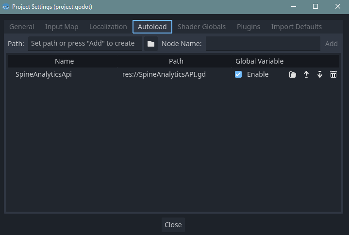

# Godot Quickstart
Before starting, make sure you have your API key and UserID which are available on the profile page. As well as the GameID of your game available in the analytics page of your game

1. Add the SpineAnalyticsAPI.gd file to your game repository
2. Add the SpineAnalyticsAPi.gd to the autoload in project->project settings->autoload
   
3. Get the spineAnalyticsApi node and initialize it 

```gdscript
var spineAnalyticsAPI

func _ready():
	spineAnalyticsAPI = get_node("/root/SpineAnalyticsApi")
	spineAnalyticsAPI.initialize("API_SECRET_KEY", "GAME_ID", "USERID")
```
Replace the values in the initialize function with your information


4. Add any data directly to the class, for example
```gdscript
spineAnalyticsAPI.gameSessionData.statistics.append({
		title = "Player Deaths",
		description = "Number of times the player died",
		value = deathCount
	})
```
Here we add a statistic of "Player Deaths" with the value of the deathCount variable (deathCount = 1) to the spineAnalyticsApi

5. Send the data

```gdscript
spineAnalyticsAPI.send_session()
```

Here is an example from the godot game in the github available here:
https://github.com/Shorssaud/ExampleGamesSpine/tree/main/GodotGame
```gdscript
extends CharacterBody2D

const SPEED = 30.0
const SHOTSPEED= 50
const SHOTWAIT = 0.3
const SHOTCOLL = 2

const BULLET = preload("res://Prefabs/bullet.tscn")

var spineAnalyticsAPI

func _ready():
	spineAnalyticsAPI = get_node("/root/SpineAnalyticsApi")
	spineAnalyticsAPI.initialize("API_SECRET_KEY", "GAME_ID")
	
func _physics_process(delta):
	# Get the input direction and handle the movement/deceleration.
	# As good practice, you should replace UI actions with custom gameplay actions.
	var horizontal = Input.get_axis("ui_left", "ui_right")
	var vertical = Input.get_axis("ui_up", "ui_down")
	
	if(Input.is_key_pressed(KEY_SPACE) && %ShotTimer.time_left <= 0):
		shoot()
	move(horizontal, vertical);
	
	
func move(horizontal, vertical):
	if (horizontal == 0 && vertical == 0):
		velocity = Vector2.ZERO;
	
	velocity = Vector2(horizontal, vertical) * SPEED;
	look_at(position + Vector2(horizontal, vertical));
	
	move_and_slide()

func shoot():
	%ShotTimer.start(SHOTWAIT)
	var main = get_tree().current_scene
	var new_bullet = BULLET.instantiate();
	main.add_child(new_bullet)
	new_bullet.global_position = %ShootingPoint.global_position;
	new_bullet.global_rotation = %ShootingPoint.global_rotation;
	new_bullet.SPEED = SHOTSPEED;
	new_bullet.COLLISIONS = 2
	
func take_damage():
	# Send statistic indicating the player died once
	spineAnalyticsAPI.gameSessionData.statistics.append({
		title = "Player Deaths",
		description = "Number of times the player died",
		value = "1"
	})
	
	# Send session data
	spineAnalyticsAPI.send_session()
	queue_free()

```